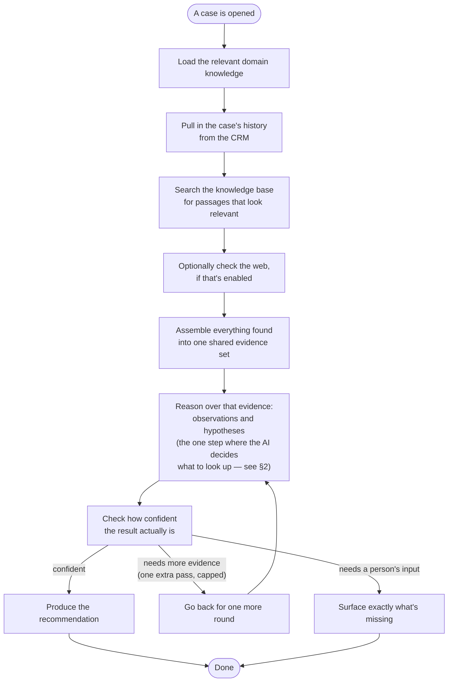
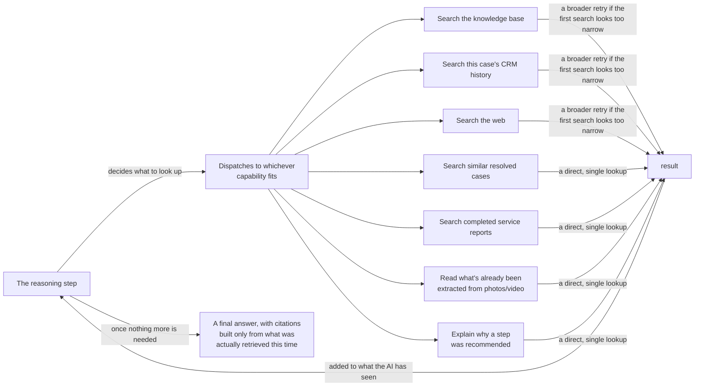
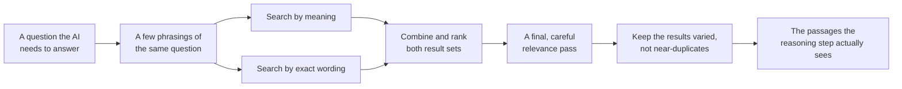

# How XANA is built

> Part of [the documentation](README.md). See also: [root README](../README.md) · [step-by-step guides](guides/) · [running it locally](setup/docker-deployment.md) · [running it in production](setup/kubernetes-deployment.md)

This page walks through how XANA actually works, from the inside out: starting at the core — the investigation engine — and working outward to the data it draws on, how its AI model is configured, the retrieval pipeline that grounds every answer in a citation, and finally the interface and hub that surround it.

## Contents

1. [The core: the investigation engine](#_1-the-core-the-investigation-engine)
2. [Connecting to your data: tools and connectors](#_2-connecting-to-your-data-tools-and-connectors)
3. [Bringing your own AI model](#_3-bringing-your-own-ai-model)
4. [How your knowledge base becomes searchable](#_4-how-your-knowledge-base-becomes-searchable)
5. [Reading manuals, photos, and diagrams](#_5-reading-manuals-photos-and-diagrams)
6. [The retrieval pipeline — tying it together](#_6-the-retrieval-pipeline-tying-it-together)
7. [The interface — where all of this shows up](#_7-the-interface-where-all-of-this-shows-up)
8. [The hub — the system of record](#_8-the-hub-the-system-of-record)

---

## 1. The core: the investigation engine

The core of the whole product is the **investigation engine** — the service that actually works a case. Everything else described in this document — the interface, the hub, the connectors — exists to hand this engine a case and get back an evidence-grounded investigation.

Reasoning is **scoped by skill**, not one monolithic pipeline: a different domain — industrial equipment servicing, say, versus a future retail or facilities-support use case — runs its own dedicated reasoning graph rather than a fork of one general-purpose flow. The skill shipped in production today supports industrial equipment maintenance and repair.

When a technician opens a case and asks XANA to investigate, the engine works through a fixed, predictable sequence:

Every follow-up chat message, step update, or "help me with this" click re-enters that same reasoning process, seeded with whatever the technician just said — the ongoing conversation and the original investigation share one underlying reasoning loop, not two separate mechanisms.

The fact worth internalizing before anything else: **the steps around the reasoning are fixed and predictable; there is exactly one point where the AI actually decides anything, and what it decides is what to look up next** — it is never simply handed one large pre-fetched dump of data and asked to summarize it.

---

## 2. Connecting to your data: tools and connectors

Rather than pre-fetching every possible piece of context up front, the reasoning step is given a fixed set of capabilities and decides for itself, turn by turn, what it actually needs — within a capped number of rounds per response, shared by both the initial investigation and every follow-up.

**A citation is never invented.** Every citation in a technician-facing answer traces back to something one of these capabilities genuinely returned during that investigation — the AI cannot cite from memory, and an answer with no supporting evidence says so rather than guessing.

### What each capability actually does

| Capability | What it looks at |
|---|---|
| Search the knowledge base | The manuals and documents already indexed for this project |
| Search CRM history | This case's notes and activity history |
| Search the web | The open web, for anything not covered by your manuals or CRM — off by default, and never a replacement for your own knowledge base |
| Search similar resolved cases | Previously resolved cases for the same account, across any product |
| Search completed service reports | Prior on-site service visits for this exact piece of equipment |
| Read attachment details | Whatever's already been extracted from photos or video attached to this case |
| Explain step context | Why a specific recommended step was generated, and what it's based on |

A few of these go through an extra, capped verification pass — broadening the search once and re-checking — specifically because a first attempt at them has a real chance of being too narrow; the rest are quick re-ranks over evidence already in hand, where a retry wouldn't add anything.

### Where the data actually comes from

The investigation engine never talks to a connected system directly. Every lookup goes through the **hub**, which has already resolved what a field in your CRM or knowledge system actually means — neither the engine nor the interface re-implements that translation. See the two connectors that ship today:

- [CRM (Dynamics)](architecture/connectors-crm-dynamics-ax.md) — what CRM-history lookups are grounded in
- [Web / storage](architecture/connectors-web.md) — one source of what gets indexed into the knowledge base

See [4. Connecting data sources](guides/04-connectors.md) for how an admin connects either one.

XANA also supports registering additional tool integrations through emerging open standards for connecting AI systems to external services. That registration layer exists today; making a registered integration's tools available to the reasoning step itself is on the roadmap, not yet live.

---

## 3. Bringing your own AI model

XANA isn't locked to one AI vendor. It speaks a widely-supported API shape for chat-style AI models, so a project can point at whichever provider you prefer — and different projects can use different providers and models, side by side, in the same deployment.

- Each project's chosen model is used for every investigation and follow-up in that project.
- If a project doesn't have one configured, XANA falls back to a shared default for the deployment.
- Swapping a project's model later doesn't require touching anything else about how that project works.

---

## 4. How your knowledge base becomes searchable

Every document you add to a knowledge base is broken into passages and given a numeric fingerprint that captures its *meaning*, not just its exact wording — which is what lets XANA find the right passage even when a technician's question doesn't use the manual's exact phrasing.

- Each project's fingerprints live in their own isolated index, so one project's manuals never leak into another project's answers.
- If the underlying indexing approach ever needs to change — a better model, for instance — XANA rebuilds the index in the background and cuts over safely, with no downtime and no risk of mixing old and new results together.

---

## 5. Reading manuals, photos, and diagrams

Manuals aren't always clean, selectable text — scanned pages, screenshots, and diagrams all need to become something an AI can actually read before they're useful.

- When a document is added to a knowledge base, XANA runs a document-understanding pass over it: extracting text from scanned or image-heavy pages, and generating a plain-language description of diagrams and schematics so a wiring diagram is just as searchable as a page of prose.
- Photos and video a technician uploads to a case on the spot go through the same kind of processing at upload time, so they can be referenced later in the investigation without anyone re-doing that work.
- Anything derived this way is clearly tagged internally as machine-generated, so it's never confused with the manufacturer's original text.

---

## 6. The retrieval pipeline — tying it together

Finding the right passage for a question uses two complementary search techniques at once — one that matches on meaning, one that matches on exact wording and terminology — and combines their results, then runs a final, more careful ranking pass to bring the truly relevant passages to the top while avoiding a set of near-duplicate results.

Indexing itself happens once, ahead of time, whenever you add or update a knowledge base — not on every single question — so an investigation stays fast and predictable rather than waiting on a live re-read of your documents each time. How much a project searches through scales with how much knowledge that project actually has, so a small knowledge base isn't over-searched and a large one isn't under-searched.

---

## 7. The interface — where all of this shows up

Everything above happens because someone clicked something in the interface. Its job is purely to be that front door — it never talks to the investigation engine or a connected system directly, only to the hub.

The shape a person navigates: a **workspace** (Service & Support, Sales, ...) contains **projects** — each one scoping which skill, AI model, domain knowledge, and knowledge base apply (see [§3](#_3-bringing-your-own-ai-model) and [§4](#_4-how-your-knowledge-base-becomes-searchable)) — and inside a project, **workbenches**, one per case. Opening a workbench and asking for repair steps is what triggers the investigation described in [§1](#_1-the-core-the-investigation-engine); every chat message or step update afterward is what triggers a follow-up reasoning pass.

Full detail: [Interface architecture](architecture/frontend.md) · [5. Projects](guides/05-projects.md) · [6. Workbenches](guides/06-workbenches.md).

## 8. The hub — the system of record

The hub is what every other piece goes through — the interface never talks to a connected system or the investigation engine directly, and the investigation engine calls back into the hub rather than reaching a connected system itself. It owns:

- The connector registrations and field translations that make [§2](#_2-connecting-to-your-data-tools-and-connectors)'s data lookups possible in the first place.
- The AI model configuration that drives [§3](#_3-bringing-your-own-ai-model).
- Project, domain-knowledge, and integration configuration referenced throughout.
- All durable state for the whole product: people, projects, connected systems, workbenches (including everything described in §1–2), and the sales module.

Full detail: [Hub architecture](architecture/backend.md).

---
