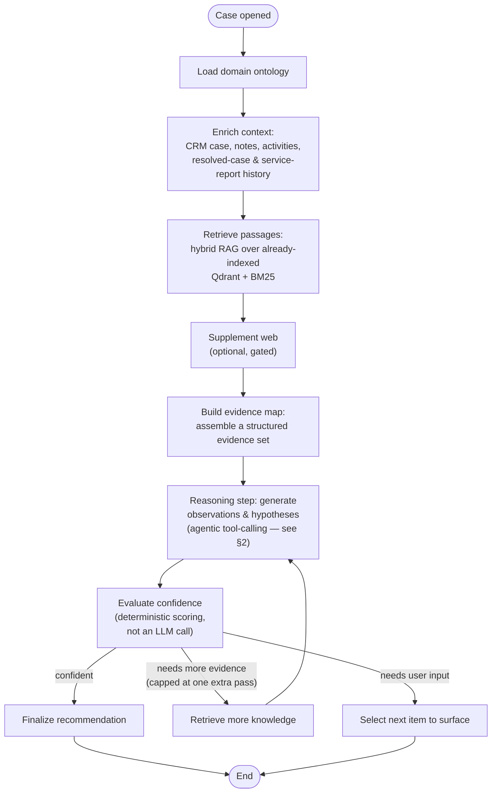
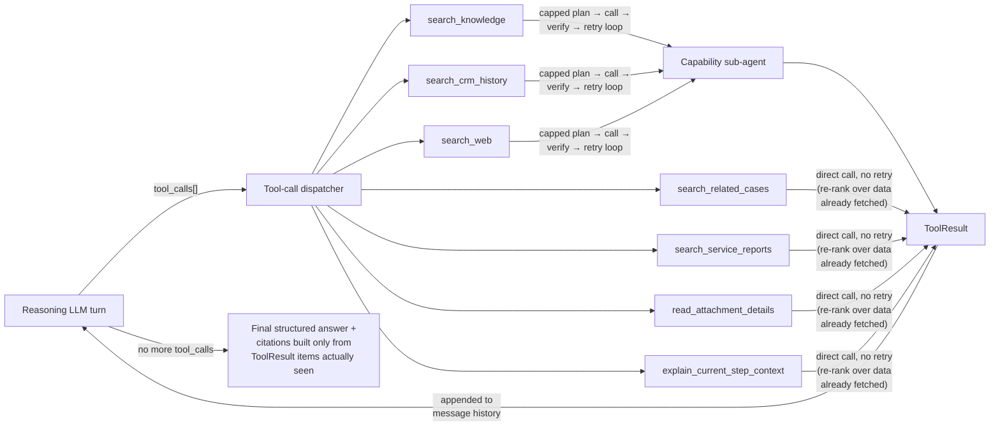
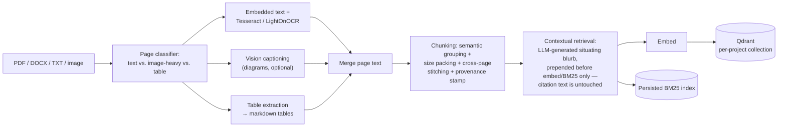
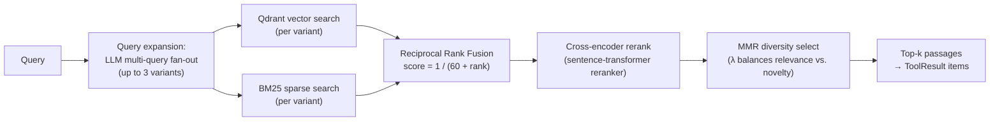

# How XANA is built

> Part of [the documentation](/docs/README.md). See also: [root README](/README.md) · [step-by-step guides](/docs/guides/) · [running it locally](/docs/setup/docker-deployment.md) · [running it in production](/docs/setup/kubernetes-deployment.md)

This page is the technical deep-dive: how the investigation engine actually reasons about a case, the protocols and algorithms behind retrieval, how the AI model layer is configured, and how the interface and hub fit around it. It's written for someone integrating with XANA or evaluating it technically — real technology choices and data flow, not a source walkthrough.

## Contents

1. [The core: the investigation engine](#_1-the-core-the-investigation-engine)
2. [Connecting to your data: tools and connectors](#_2-connecting-to-your-data-tools-and-connectors)
3. [Bringing your own AI model](#_3-bringing-your-own-ai-model)
4. [How your knowledge base becomes searchable](#_4-how-your-knowledge-base-becomes-searchable)
5. [Reading manuals, photos, and diagrams](#_5-reading-manuals-photos-and-diagrams)
6. [The retrieval pipeline — tying it together](#_6-the-retrieval-pipeline-tying-it-together)
7. [The interface — where all of this shows up](#_7-the-interface-where-all-of-this-shows-up)
8. [The hub — the system of record](#_8-the-hub-the-system-of-record)

---

## 1. The core: the investigation engine

The core of the product is the **investigation engine** — a Python service built on **LangGraph**, running as its own deployable alongside the interface and the hub, listening on port 8000. Everything else in this document exists to feed this engine a case and get back an evidence-grounded investigation.

Reasoning is **scoped by skill**, not one monolithic pipeline: a registry maps each domain to its own **analysis / continue / synthesis graph triple**, so a new domain is a new graph registered alongside the existing ones, never a fork of a shared pipeline. The skill running in production today covers industrial equipment maintenance and repair.

The **analysis graph** is a LangGraph state machine — deterministic node wiring, not itself an LLM decision — that runs one investigation pass:

The **continue graph** — triggered on every technician chat message, step-status change, or "ask for help" — re-enters the same reasoning call, seeded with what the technician just said, rather than being a second mechanism. Both graphs funnel into **one shared reasoning core**.

The structural fact worth internalizing: the outer graph nodes are a fixed, deterministic pipeline; exactly one node (the reasoning step) is where the model actually decides anything, and it decides by calling tools — it is never handed one pre-fetched context dump and asked to summarize it.

---

## 2. Connecting to your data: tools and connectors

Rather than pre-fetching every possible piece of context up front, the reasoning step is given a fixed menu of **tools** (OpenAI-style function-calling) and decides for itself, turn by turn, what to look up — up to a capped number of rounds (`MAX_TOOL_TURNS`, 4 by default) per reasoning call, shared by both the analysis and continue graphs.

A citation can never appear in an answer unless it traces back to a real item a tool actually returned that turn — enforced by a dedicated citation-verification step that cross-checks every citation against the tool-call log, not just a prompt instruction. The model cannot author a citation from memory.

### The seven tools

| Tool | What it searches | Where the data actually comes from | Retry-wrapped? |
|---|---|---|---|
| `search_knowledge` | This project's ingested manuals/knowledge-scope documents | Already-indexed **Qdrant + BM25** content (§6) — not a live connector call per query | Yes |
| `search_crm_history` | This case's CRM activities and notes | CRM context fetched once when the workbench was created/enriched, via the hub | Yes |
| `search_web` | The public web, for things not in manuals or CRM | An optional, gated web-search provider | Yes |
| `search_related_cases` | This account's previously resolved cases, any product | A case-history snapshot fetched at workbench creation, re-ranked locally — never a fresh CRM call | No |
| `search_service_reports` | Completed on-site service-visit reports for this exact machine | Same idea — a snapshot fetched once, re-ranked locally | No |
| `read_attachment_details` | Already-extracted OCR/vision text from uploaded photos/videos | Whatever was already extracted at upload time — never triggers new OCR | No |
| `explain_current_step_context` | The rationale and citations a specific step was generated from | The step's own stored data — internal, no external source | No |

Only three of the seven go through a capped **plan → call → verify → retry** sub-agent loop: the ones with a real chance that a first query is too narrow and worth one broadened retry. The other four are cheap re-ranks over data already in hand, where a retry buys nothing.

### Where the data actually comes from

Neither `search_knowledge` nor `search_crm_history` talks to a connector directly. The investigation engine calls the **hub's REST API**, which has already resolved the connector's manifest and field mappings:

- `search_crm_history` reads CRM context fetched from the hub at workbench-creation/enrichment time.
- `search_knowledge` reads Qdrant/BM25 indexes kept current by a separate, explicit reindex step — deliberately, to avoid live connector round-trips (and their latency/timeout risk) on every analyze/continue call.

The two connectors that ship today, each its own architecture page:

- [CRM (Dynamics)](/docs/architecture/connectors-crm-dynamics-ax.md) — what `search_crm_history` is grounded in
- [Web / storage](/docs/architecture/connectors-web.md) — one source of what gets ingested into `search_knowledge`'s index

See [4. Connecting data sources](/docs/guides/04-connectors.md) for how an admin registers either one.

### Tool integrations via MCP — provisioned, not yet wired into reasoning

XANA's integration layer supports registering external tool servers over the **Model Context Protocol (MCP)** — a project can enable one or more MCP servers over SSE/HTTP, and the hub stores that registration. The investigation engine has a working MCP client capable of connecting to a server, listing its tools, and returning them as callables. **What doesn't exist yet is the wire from that client into the reasoning loop above** — the agentic tool-calling step only ever offers the seven fixed tools today. Treat MCP as implemented integration infrastructure, not yet a live source an investigation can call.

---

## 3. Bringing your own AI model

The investigation engine isn't hardwired to one AI vendor — it speaks a single HTTP contract, **OpenAI-compatible chat completions** (`POST {baseUrl}/v1/chat/completions`, or an already-suffixed URL), and both the tool-calling reasoning loop and the final structured-JSON answer turn go through that same contract.

Which endpoint is actually called is decided per request, not fixed at process start:

- The hub's AI-provider configuration stores a provider's type (`openai_compatible` / `anthropic` / `azure_openai` / `ollama`), base URL, model, and an encrypted API key, per project.
- On each analyze/continue call, the hub passes that project's chosen provider through as a request-scoped configuration, which the engine prefers over its own environment defaults for that one request.
- **Integration nuance worth knowing**: regardless of which provider type is labeled in configuration, the engine's own HTTP call always assumes the OpenAI-compatible `/chat/completions` request/response shape — there's no separate native Anthropic or Azure OpenAI call path today. A provider registered as `anthropic` still needs to expose an OpenAI-compatible endpoint to actually work.
- If no per-request provider is supplied, the engine falls back to its own environment-configured default (`OPENAI_COMPATIBLE_BASE_URL` / `_API_KEY` / `_MODEL`).

---

## 4. How your knowledge base becomes searchable

Retrieval needs a second model, separate from the reasoning LLM: an **embedding model**, configured via `EMBEDDING_MODEL` + `EMBEDDING_VECTOR_SIZE`.

- Embeddings are requested from the **same OpenAI-compatible base URL** as the chat model, at its `/embeddings` path — one provider serving both contracts.
- **Unlike the chat model, the embedding model is not per-project overridable today** — every project in a deployment shares one embedding configuration, set once for the whole deployment.
- If no embedding endpoint is configured, a deterministic, local hash-based fallback keeps retrieval functional in a degraded, non-semantic mode rather than failing outright.

Vectors land in **Qdrant**, one isolated collection per project — named opaquely so a collection name never leaks the project's identity. What's stored per point: the chunk text, its embedding vector, and metadata (source file, connector, page, section title, chunk type) plus provenance flags that let retrieval tell manufacturer-authored text apart from OCR output or an AI-generated diagram caption.

Collections are accessed through a **stable alias** sitting in front of a versioned physical collection. Changing the embedding model or the chunking approach bumps that version, which creates a new physical collection behind the alias; a background backfill job re-embeds existing content and atomically promotes the alias once it's caught up, so old projects keep serving from the previous collection until the cutover completes. This version has already been bumped more than once in production — for an embedding-model change and for a chunking rework — with zero downtime and no risk of comparing incompatible vectors against each other.

---

## 5. Reading manuals, photos, and diagrams

Manuals aren't always clean, embedded PDF text — scanned pages, screenshots, and diagrams need to become searchable text before they can be chunked and embedded. Two distinct mechanisms handle this, at two different times:

**Ingestion-time OCR**, for image-heavy pages in ingested PDFs/DOCX:
- **Tesseract** — host-installed, optional (`OCR_FALLBACK_TESSERACT`), general-purpose text extraction from embedded page images.
- **LightOnOCR** (`lightonai/LightOnOCR-2-1B` by default, `OCR_MODEL`/`OCR_ENABLED`) — a dedicated document-OCR vision-language model, called over the same OpenAI-compatible chat-completions contract as the reasoning LLM, given the page image as an image content part.
- Embedded PDF text and per-image OCR text are merged per page, and that merge — not the raw PDF text alone — is what actually gets chunked.

**Ingestion-time vision captioning** is a *separate* concept from OCR — it doesn't extract text, it generates a natural-language caption for a diagram or schematic, via a self-hosted **Ollama** or **OpenVINO Model Server (OVMS)** serving a vision-language model (`qwen2.5vl:32b` by default). It's off by default (`VISION_CAPTION_ENABLED`), rate-limited to one concurrent call (CPU inference for a vision model is slow — 100+ seconds per call measured in practice), carries a hard output-token cap since small vision-language models don't reliably self-terminate, and trips a circuit breaker after repeated failures. Caption text is stamped with a provenance flag so it's never confused with authored manual text downstream.

**Technician-upload OCR** is a third, separate path: photos and video a technician uploads to a workbench are OCR'd with the same document-OCR model at upload time, and the only tool that reads the result (`read_attachment_details`, [§2](#_2-connecting-to-your-data-tools-and-connectors)) never re-triggers OCR — it just reads what was already extracted.

---

## 6. The retrieval pipeline — tying it together

This is where OCR output, embeddings, and Qdrant come together — hybrid retrieval, not keyword search and not vector search alone.

**Ingestion** (once per document, triggered by the knowledge-scope reindex flow, not per query):

**Retrieval** (every `search_knowledge` tool call):

A few implementation details that matter for anyone integrating against this:

- The BM25 index is built once per retrieval call and cached in-process for the scope of an investigation, not rebuilt per query variant.
- Candidate-pool and rerank-pool sizes scale with the size of a project's knowledge base rather than being flat constants — a large knowledge base gets more retrieval depth than a small one, at predictable cost either way.
- Chunking is more than fixed-size splitting: paragraphs are grouped by embedding-similarity ("semantic chunking") before size-based packing, table content is extracted and chunked separately from prose, and chunks spanning a page break are stitched back together. Adjacent-chunk overlap and exact-duplicate dropping exist as configuration options (`CHUNKING_OVERLAP_CHARS`, `CHUNKING_DEDUP_ENABLED`) but default off, since turning either on requires a `CHUNKING_SCHEMA_VERSION` bump to actually take effect on already-cached content.
- Retrieval is never live-connector-backed at query time — see the note in [§2](#_2-connecting-to-your-data-tools-and-connectors). Keeping Qdrant/BM25 current for a project's knowledge scope is a separate, explicit reindex action.

---

## 7. The interface — where all of this shows up

Everything above happens because a technician clicked something in the interface — a Next.js (App Router) application. The interface's job is purely to be that front door — it never talks to the investigation engine or a connector directly, only to the hub.

The shape a technician navigates: a **workspace** (Service & Support, Sales, ...) contains **projects** (each one scoping which skill, AI model, ontology, and knowledge base apply — see [§3](#_3-bringing-your-own-ai-model) and [§4](#_4-how-your-knowledge-base-becomes-searchable)), and inside a project, **workbenches** — one per case. Opening a workbench and asking for repair steps is what triggers the analysis graph in [§1](#_1-the-core-the-investigation-engine); every subsequent chat message or step-status change triggers the continue graph.

Full detail: [Interface architecture](/docs/architecture/frontend.md) · [5. Projects](/docs/guides/05-projects.md) · [6. Workbenches](/docs/guides/06-workbenches.md).

## 8. The hub — the system of record

The NestJS hub, listening on port 4000, is what every other piece goes through — the interface never calls a connector or the investigation engine directly, and the investigation engine calls back into the hub rather than hitting a connector itself. It owns:

- The connector registrations and field mappings that make [§2](#_2-connecting-to-your-data-tools-and-connectors)'s `search_crm_history` and `search_knowledge` possible in the first place.
- The AI-provider configuration that drives [§3](#_3-bringing-your-own-ai-model).
- Project, ontology, and integration configuration referenced throughout.
- All durable state, in **MongoDB** — people, projects, connectors, workbenches (including the investigation state described in §1–2), and the sales module.

Full detail: [Hub architecture](/docs/architecture/backend.md).

---
