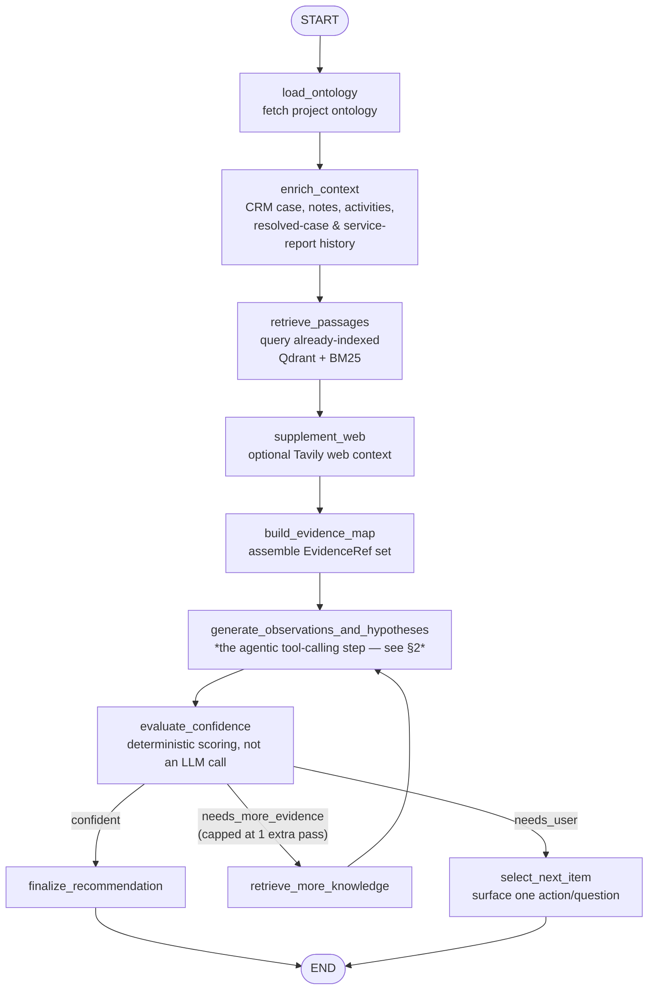
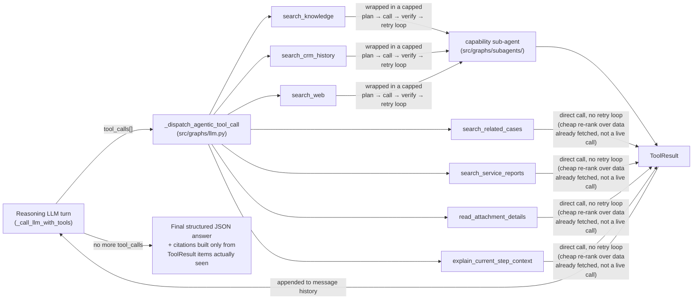
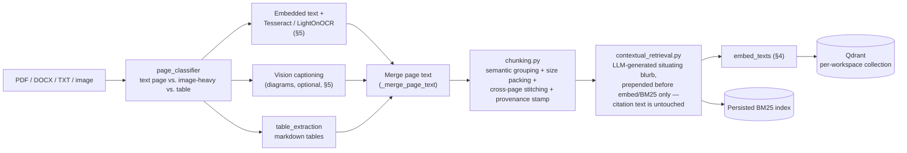
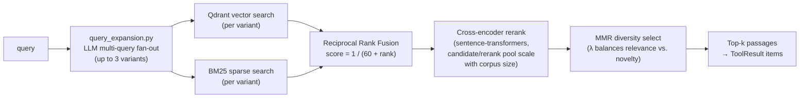

# XANA Technical Architecture

> Part of [docs/](README.md). See also: [root README](../README.md) · [step-by-step guides](guides/) · [Docker deployment](setup/docker-deployment.md) · [Kubernetes deployment](setup/kubernetes-deployment.md)

This document explains how XANA is built, from the inside out: it starts at the core — the LangGraph workflow agent — and works outward to the data sources it calls, the LLM/embedding/OCR configuration it runs on, the retrieval pipeline that grounds its answers, and finally the frontend and backend that surround it. Everything here was verified directly against the current source, not carried over from an older write-up.

## Contents

1. [The core: the workflow agent](#1-the-core-the-workflow-agent)
2. [Connecting to data sources: tool calling, connectors, and MCP](#2-connecting-to-data-sources-tool-calling-connectors-and-mcp)
3. [Configuring the LLM](#3-configuring-the-llm)
4. [Embeddings and the vector store](#4-embeddings-and-the-vector-store)
5. [OCR and document parsing](#5-ocr-and-document-parsing)
6. [The RAG pipeline — tying it together](#6-the-rag-pipeline--tying-it-together)
7. [Frontend — the interface to the workflow agent](#7-frontend--the-interface-to-the-workflow-agent)
8. [Backend — hub and persistence](#8-backend--hub-and-persistence)

---

## 1. The core: the workflow agent

The core of this whole application is the **workflow agent** (`workflow-agent/`, port 8000) — a Python/FastAPI service built on **LangGraph**. Everything else in this document — the frontend, the backend, the connectors — exists to feed this agent a case and receive back an evidence-grounded investigation.

Graphs are **skill-scoped**: `src/graphs/registry.py` maps a `skill_id` to an (analysis, continue, synthesis) graph triple, so a different domain skill is a different graph triple, not a fork of one monolithic pipeline. The one shipped today is `metal_processing_support`.

The **analysis graph** (`src/graphs/skills/metal_processing_support/analysis_graph.py`) is a LangGraph state machine — deterministic node wiring, not itself an LLM decision — that orchestrates one investigation pass:

The **continue graph** (triggered on every technician chat message, step feedback, or "ask for help") re-enters the same `generate_observations_and_hypotheses`-style reasoning call — `revise_findings_after_user_feedback` in `src/graphs/llm.py` — seeded with what the technician just said, rather than a separate mechanism. Both graphs, in other words, funnel into **one shared reasoning core**: a single LLM call pattern that can call tools, described next.

This is the key structural fact worth internalizing before anything else: **the outer LangGraph nodes are a fixed, deterministic pipeline; exactly one node in that pipeline (`generate_observations_and_hypotheses`) is where the LLM actually reasons, and it reasons by calling tools, not by being handed a pre-fetched data dump.**

---

## 2. Connecting to data sources: tool calling, connectors, and MCP

Rather than the graph pre-fetching every possible piece of context up front, the reasoning LLM is given a fixed menu of **tools** (OpenAI-style function-calling) and decides for itself, turn by turn, what it needs to look up — up to `MAX_TOOL_TURNS` (4 by default, `src/config.py`) rounds per reasoning call, shared by both the analysis and continue graphs.

A citation can never appear in a technician-facing answer unless it traces back to a real item a tool actually returned that turn (`assemble_evidence_from_tool_log`, cross-checked by `src/context/citation_verify.py`) — the model cannot author a citation from memory.

### The seven tools (`src/graphs/tools/chat_tools.py`)

| Tool | What it searches | Where the data actually comes from | Retry-wrapped? |
|---|---|---|---|
| `search_knowledge` | This workbench's ingested manuals/knowledge-scope documents | **Qdrant + BM25** — already-indexed content (see [§6](#6-the-rag-pipeline--tying-it-together)), *not* a live connector call per query | Yes — `knowledge_lookup` sub-agent |
| `search_crm_history` | This case's CRM activities and notes | The CRM context fetched once when the workbench was enriched, via the backend → [CRM connector](architecture/connectors-crm-dynamics-ax.md) | Yes — `crm_lookup` sub-agent |
| `search_web` | The public internet, for things not in manuals or CRM | Tavily (gated, optional — see [§5](#5-ocr-and-document-parsing) config) | Yes — `web_search` sub-agent |
| `search_related_cases` | This account's previously *resolved* cases, any product | A case-history snapshot already fetched at workbench creation, re-ranked locally — never a fresh CRM call | No |
| `search_service_reports` | Completed on-site service-visit reports for this exact machine | Same idea — a snapshot already fetched, re-ranked locally | No |
| `read_attachment_details` | Already-extracted OCR/vision text from this workbench's uploaded photos/videos | Whatever `read_attachment_details_tool` finds already stored on the attachment — never triggers new OCR | No |
| `explain_current_step_context` | The rationale and citations a specific troubleshooting step was generated from | The step's own stored data — internal, no external source | No |

Only three of the seven go through the capped `plan → call → verify → retry` sub-agent loop (`src/graphs/subagents/common.py`): the ones with a real chance that a first query is too narrow and worth one broadened retry. The other four are cheap re-ranks over data already in hand, so a retry buys nothing.

### Connectors: where `search_knowledge` and `search_crm_history` ultimately lead

Neither tool talks to a connector directly. The workflow-agent never calls a connector — it calls the **backend's REST API**, which already resolved the OpenXANA manifest and field mappings:

- `search_crm_history` reads CRM context fetched from the backend at workbench-creation/enrichment time.
- `search_knowledge` reads Qdrant/BM25 indexes that are kept current by a separate reindexing step, not by this tool call — deliberately, to avoid live connector round-trips (and their latency/timeout risk) on every single analyze/continue call.

The two connectors that ship today, each its own architecture page:

- [CRM (Dynamics AX)](architecture/connectors-crm-dynamics-ax.md) — what `search_crm_history` is ultimately grounded in
- [Web / storage](architecture/connectors-web.md) — one source of what gets ingested into `search_knowledge`'s index

See [4. Connecting data sources](guides/04-connectors.md) for how an admin registers either one.

### MCP — implemented, not yet wired in

MCP is provisioned at the configuration layer today, not yet at the reasoning layer: a project can enable one or more MCP servers (`backend/src/mcp-servers`, a project's `enabledMcpServerIds`), and `workflow-agent/src/mcp_client.py` has a working `load_mcp_tools()` that connects over SSE/HTTP, lists a server's tools, and returns them as callables. **However, nothing in `src/graphs/llm.py` currently calls `load_mcp_tools()`** — the agentic tool-calling loop above only ever offers the seven fixed tools. An enabled MCP server is stored and ready, but the wire from "project has this MCP server enabled" to "the reasoning LLM can actually call one of its tools" doesn't exist yet. Treat MCP as implemented infrastructure for a data source, not yet a working one.

---

## 3. Configuring the LLM

The workflow agent is not hardwired to one LLM vendor — it speaks a single HTTP contract (**OpenAI-compatible chat completions**, `POST {baseUrl}/v1/chat/completions` or an already-suffixed URL) and everything above (the reasoning tool-calling loop, and the final structured-JSON answer turn) goes through that same contract.

Which endpoint it actually calls is decided per request, not fixed at process start:

- The backend's `ai-providers` module ([4. Connecting data sources](guides/04-connectors.md)) stores a provider's type (`openai_compatible` / `anthropic` / `azure_openai` / `ollama`), base URL, model, and encrypted API key per project.
- On each analyze/continue call, the backend passes that project's chosen provider through as an `AiProviderConfig` (`baseUrl`/`model`/`apiKey`), which `src/graphs/llm.py` stores in a request-scoped context var (`set_request_ai_provider`) and prefers over the workflow-agent's own `.env` defaults for that one request.
- **Nuance worth knowing**: regardless of which `providerType` the backend has stored, the workflow-agent's own HTTP call always assumes the OpenAI-compatible `/chat/completions` request/response shape — there's no separate native Anthropic or Azure OpenAI call path today. A provider registered as `anthropic` still needs to expose an OpenAI-compatible endpoint to actually work.
- If no per-request provider is supplied, it falls back to `OPENAI_COMPATIBLE_BASE_URL` / `_API_KEY` / `_MODEL` from the workflow-agent's own `.env`.

---

## 4. Embeddings and the vector store

Retrieval needs a second model, separate from the reasoning LLM: an embedding model, configured via `EMBEDDING_MODEL` + `EMBEDDING_VECTOR_SIZE` (`src/config.py`).

- Embeddings are requested from the **same OpenAI-compatible base URL** as the chat LLM, at its `/embeddings` path (`src/rag/embeddings.py`) — one provider serving both contracts.
- **Unlike the chat LLM, embeddings are not per-project overridable today** — `embed_texts`/`embed_query` always use the global `.env` configuration, never the per-request `AiProviderConfig`. Every project in a deployment shares one embedding model.
- If no embedding endpoint is configured, a deterministic local hash-based fallback (`_hash_embedding`) keeps retrieval functional (degraded — no real semantics) rather than failing outright.

Vectors land in **Qdrant** (`src/rag/vector_store.py`), one collection per workspace, named by a SHA1 hash of the workspace id so it never leaks the workspace id itself. What's actually stored per point: the chunk text, its embedding vector, and metadata — `fileId`, `connectorId`, `page`, `sectionTitle`, `chunkType`, and provenance flags (`contentOrigin`, `imageRef`) that let retrieval later tell manufacturer-authored text apart from OCR output or an AI-generated diagram caption.

A detail worth knowing if you ever change the embedding model or chunking logic: collections are accessed through a **stable alias**, with a `VECTOR_SCHEMA_VERSION` behind it (currently `4`). Bumping that version (done three times already, per `src/rag/vector_store.py`'s own changelog comment: a diagram-ingestion/provenance fix, an embedding-model change, and a chunking rework) creates a new physical collection; old workspaces keep serving from the old one until `scripts/backfill_reindex.py` re-embeds and atomically promotes the alias. This is what makes changing the embedding model or chunk boundaries a safe, zero-downtime cutover instead of silently comparing incompatible vectors.

---

## 5. OCR and document parsing

Manuals aren't always clean, embedded PDF text — scanned pages, screenshots, and diagrams need to become searchable text before they can be chunked and embedded. Two distinct mechanisms handle this, at two different times:

**Ingestion-time OCR** (`src/rag/document_ingest.py`, the real entry point behind the `pdf_ingest.py` compat shim), for image-heavy pages in ingested PDFs/DOCX:
- **Tesseract** — host-installed, optional (`OCR_FALLBACK_TESSERACT`), general-purpose text extraction from embedded page images.
- **LightOnOCR-2-1B** (`src/rag/lighton_ocr.py`) — a document-OCR vision model called over the same Ionos OpenAI-compatible chat-completions API as the reasoning LLM (`OCR_MODEL`, `OCR_ENABLED`), sending the image as an `image_url` content part.
- Embedded PDF text and per-image OCR text are merged per page (`_merge_page_text`), and the merge is what actually gets chunked — not the raw PDF text alone.

**Ingestion-time vision captioning** (`src/rag/vision_caption.py`) is a *separate* concept from OCR — it doesn't extract text, it generates a natural-language caption for a diagram/schematic, via a self-hosted Ollama or OpenVINO Model Server (OVMS) serving a vision-language model (`qwen2.5vl:32b` by default). It's off by default (`VISION_CAPTION_ENABLED`), rate-limited to one concurrent call (CPU inference is slow — 100s+ per call measured live), has a hard output-token cap (small VL models don't reliably self-terminate), and trips a circuit breaker after repeated failures. Caption text is stamped with `contentOrigin` so it's never confused with authored manual text downstream.

**Technician-upload OCR** is a third, separate path (`src/rag/step_media_ocr.py` / `media_processor.py`): photos and video a technician uploads to a workbench are OCR'd with LightOnOCR at upload time, and the *only* tool that reads the result (`read_attachment_details`, [§2](#2-connecting-to-data-sources-tool-calling-connectors-and-mcp)) never re-triggers OCR — it just reads what was already extracted.

---

## 6. The RAG pipeline — tying it together

This is where OCR output, embeddings, and Qdrant come together — hybrid retrieval, not keyword search and not vector search alone.

**Ingestion** (once per document, triggered by the knowledge-scope reindex flow, not per query):

**Retrieval** (every `search_knowledge` tool call):

A few implementation details that matter for anyone extending this:

- The BM25 index is built once per retrieval call and cached in-process for the scope of an investigation (`sparse_index.get_or_build_bm25_index`), not rebuilt per query variant.
- Candidate-pool and rerank-pool sizes scale with the scoped corpus size (`retriever.derive_candidate_pool`, config-bounded min/max) rather than being flat constants — a huge knowledge base gets more retrieval depth than a tiny one, at predictable cost either way.
- Chunking is more than fixed-size splitting: paragraphs are grouped by embedding-similarity ("semantic chunking") before size-based packing, table content is extracted and chunked separately from prose, and chunks spanning a page break are stitched back together. Adjacent-chunk overlap and exact-duplicate dropping exist in config (`CHUNKING_OVERLAP_CHARS`, `CHUNKING_DEDUP_ENABLED`) but both default off, since turning either on needs a `CHUNKING_SCHEMA_VERSION` bump to actually take effect on cached content.
- Retrieval is never live-connector-backed at query time — see the note in [§2](#2-connecting-to-data-sources-tool-calling-connectors-and-mcp). Keeping Qdrant/BM25 current for a project's knowledge scope is a separate, explicit reindex action.

---

## 7. Frontend — the interface to the workflow agent

Everything above happens because a technician clicked something in the Next.js frontend. The frontend's job is purely to be that interface — it never talks to the workflow agent or a connector directly, only to the backend.

The shape a technician navigates: a **workspace** (Service & Support, Sales, ...) contains **projects** (each one scoping which skill, AI provider, ontology, and knowledge base apply — see [§3](#3-configuring-the-llm) and [§4](#4-embeddings-and-the-vector-store)), and inside a project, **workbenches** — one per case. Opening a workbench and clicking **Get repair steps** is what actually triggers the analysis graph in [§1](#1-the-core-the-workflow-agent); every subsequent chat message or step-status change is what triggers the continue graph.

Full detail: [Frontend architecture](architecture/frontend.md) · [5. Projects](guides/05-projects.md) · [6. Workbenches](guides/06-workbenches.md).

## 8. Backend — hub and persistence

The NestJS backend is the hub every other piece goes through — the frontend never calls a connector or the workflow agent directly, and the workflow agent calls back into the backend rather than hitting a connector itself. It owns:

- The OpenXANA connector registrations and field mappings that make [§2](#2-connecting-to-data-sources-tool-calling-connectors-and-mcp)'s `search_crm_history` and `search_knowledge` possible in the first place.
- The `ai-providers` config that drives [§3](#3-configuring-the-llm).
- The `projects`/`ontology`/`mcp-servers` config referenced throughout.
- All durable state, in **MongoDB** — users, projects, connectors, workbenches (including the investigation state described in §1-2), and the sales module.

Full detail: [Backend architecture](architecture/backend.md).

---

